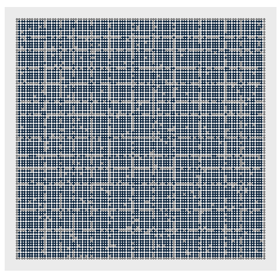

```{r setup, include=FALSE}
library(gganimate)
library(gifski)
library(ggplot2)
library(reshape2)
library(knitr)
library(dplyr)
library(stringr)
library(tidyverse)
library(readr)
library(collections)
options(scipen = 999)
```

```{r}
input<-read_lines("Day11Sample.txt")

```

## Part 1

Change it into numbers, because that is easier to compare
```{r}
### Matrix
seatingarea<-matrix(NA,nrow=length(input)+2,ncol=nchar(input[1])+2)
for(i in 1:length(input)){
  x<-unlist(str_split(input[i],""))
  x[which(x==".")]<-NA
  x[which(x=="L")]<-0
  x<-as.numeric(x)
  seatingarea[(i+1),]<-c(NA,x,NA)}

```
The function takes in the matrix & spits out the seat change

```{r}
switchseats<-function(m){
  nxt<-matrix(NA,nrow=nrow(m),ncol=ncol(m))
  for(r in 1:nrow(m)){
    for(c in 1:ncol(m)){if(!is.na(m[r,c])){
      if(m[r,c]==0){
        if(sum(m[(r-1):(r+1),(c-1):(c+1)],na.rm=TRUE)==0){nxt[r,c]<-1}else{nxt[r,c]<-0}}
      if(m[r,c]==1){
        if(sum(m[(r-1):(r+1),(c-1):(c+1)],na.rm=TRUE)>=5){nxt[r,c]<-0}else{nxt[r,c]<-1}}}}}
  
nxt}

```


```{r}
stableseats<-function(m){
  keepgoing<-TRUE
  while(keepgoing){
    n<-switchseats(m)
    if(all(n[which(!is.na(n))]==m[which(!is.na(m))])){keepgoing<-FALSE}
    m<-n}
  answer<-sum(m,na.rm=TRUE)
answer}
```


```{r}
part1<-stableseats(seatingarea)
part1
```
```{r,echo=FALSE,message=FALSE,warning=FALSE}
plotmakershort<-function(m){
  outdf<-melt(m)
  outdf<-outdf%>%rowwise%>%mutate(t=0)
  counter<-1
  keepgoing<-TRUE
  while(keepgoing){
    n<-switchseats(m)
    if(all(n[which(!is.na(n))]==m[which(!is.na(m))])){keepgoing<-FALSE}
    m<-n
    y<-melt(m)
    y<-y%>%rowwise%>%mutate(t=counter)
    outdf<-rbind(outdf,y)
    counter<-counter+1}
  answer<-sum(m,na.rm=TRUE)
  outdf}

shortgr<-plotmakershort(seatingarea)

basicgraph<-ggplot()+
  theme(axis.text.x = element_blank(),
        axis.ticks.x = element_blank(),
        axis.text.y = element_blank(),
        axis.ticks.y = element_blank(),
        axis.title.y = element_blank(),
        axis.title.x = element_blank(),
        panel.grid.major = element_blank(),
        panel.grid.minor = element_blank(),
        legend.position="none")+
  scale_y_reverse()+
  coord_fixed()

animshort<-basicgraph+
  geom_point(data=shortgr,aes(x=Var2,y=Var1,color=value),size=10)+
  transition_time(t)

day11animationshort<-animate(animshort,nframes=24,
                             renderer = gifski_renderer(),end_pause=15)
```


```{r,echo=FALSE}
day11animationshort
```





##  Part 2

For part 2, there's a change in the way that the comparison is made.  I can't think of a way to do this more easily (sadly), so it's going to be slow


```{r}
### These four find whether the next chair to the diagonals is visible
upleft<-function(r,c,m){
  x<-NA
  while(r>1&&c>1&&is.na(x)){
    r<-r-1
    c<-c-1
    x<-m[r,c]}
  if(is.na(x)){x<-0}
x}

upright<-function(r,c,m){
  x<-NA
  while(r>1&&c<ncol(m)&&is.na(x)){
    r<-r-1
    c<-c+1
    x<-m[r,c]}
  if(is.na(x)){x<-0}
  x}

downleft<-function(r,c,m){
  x<-NA
  while(r<nrow(m)&&c>1&&is.na(x)){
    r<-r+1
    c<-c-1
    x<-m[r,c]}
  if(is.na(x)){x<-0}
x}

downright<-function(r,c,m){
  x<-NA
  while(r<nrow(m)&&c<ncol(m)&&is.na(x)){
    r<-r+1
    c<-c+1
    x<-m[r,c]}
  if(is.na(x)){x<-0}
  x}

longswitch<-function(m){
  nxt<-matrix(NA,nrow=nrow(m),ncol=ncol(m))
  chda<-0
  chdb<-0
  for(r in 1:nrow(m)){
    for(c in 1:ncol(m)){
      if(!is.na(m[r,c])){
      ##up
      U<-m[(r-1):1,c]
      U<-U[which(!is.na(U))]
      if(length(U)==0){U=0}else{U<-U[1]}
      ##down
      D<-m[(r+1):nrow(m),c]
      D<-D[which(!is.na(D))]
      if(length(D)==0){D=0}else{D<-D[1]}
      ##left
      L<-m[r,(c-1):1]
      L<-L[which(!is.na(L))]
      if(length(L)==0){L=0}else{L<-L[1]}
      ##right
      R<-m[r,(c+1):ncol(m)]
      R<-R[which(!is.na(R))]
      if(length(R)==0){R=0}else{R<-R[1]}
      UR<-upright(r,c,m)
      UL<-upleft(r,c,m)
      DR<-downright(r,c,m)
      DL<-downleft(r,c,m)
      ### add together all the changes
      starsum<-D+R+L+U+UL+UR+DR+DL
      if(m[r,c]==0){
        if(starsum==0){nxt[r,c]<-1
        ## increment change counter
        chda<-chda+1}else{nxt[r,c]<-0}}
      if(m[r,c]==1){
        if(starsum>=5){nxt[r,c]<-0
        ## increment change counter
        chdb<-chdb+1}else{nxt[r,c]<-1}}
      }}}
list(nxt,chda+chdb)}

```

As before, repeat until no more changes

```{r}
longstableseats<-function(m){
  keepgoing<-TRUE
  while(keepgoing){
    x<-longswitch(m)
    ##x[[1]] is the updated matrix.  x[[2]] is the number of changes made
    m<-x[[1]]
    if(x[[2]]==0){keepgoing<-FALSE}}
  answer<-sum(m,na.rm=TRUE)
  answer}
```


```{r}
part2<-longstableseats(seatingarea)
part2
```


```{r,echo=FALSE,message=FALSE,warning=FALSE}
plotmakerlong<-function(m){
  outdf<-melt(m)
  outdf<-outdf%>%rowwise%>%mutate(t=0)
  counter<-1
  keepgoing<-TRUE
  while(keepgoing){
    x<-longswitch(m)
    ##x[[1]] is the updated matrix.  x[[2]] is the number of changes made
    m<-x[[1]]
    if(x[[2]]==0){keepgoing<-FALSE}
    y<-melt(m)
    y<-y%>%rowwise%>%mutate(t=counter)
    outdf<-rbind(outdf,y)
    counter<-counter+1}
  answer<-sum(m,na.rm=TRUE)
  outdf}

longgr<-plotmakerlong(seatingarea)

basicgraph<-ggplot()+
  theme(axis.text.x = element_blank(),
        axis.ticks.x = element_blank(),
        axis.text.y = element_blank(),
        axis.ticks.y = element_blank(),
        axis.title.y = element_blank(),
        axis.title.x = element_blank(),
        panel.grid.major = element_blank(),
        panel.grid.minor = element_blank(),
        legend.position="none")+
  scale_y_reverse()+
  coord_fixed()
animlong<-basicgraph+
  geom_point(data=longgr,aes(x=Var2,y=Var1,color=value),size=10)+
  transition_time(t)

day11animation<-animate(animlong,nframes=24,renderer = gifski_renderer(),end_pause=15)
```


```{r,echo=FALSE}
day11animation
```


