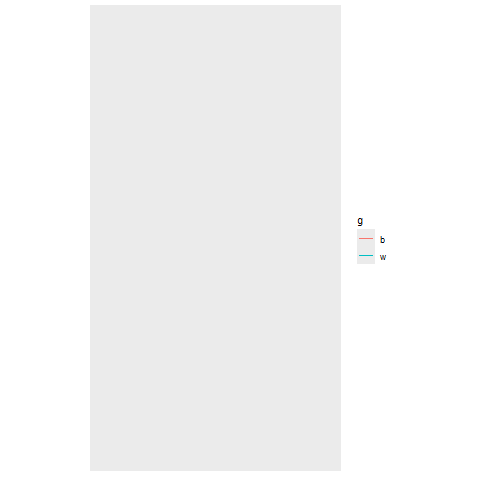

```{r setup, include=FALSE}
library(gifski)
library(gganimate)
library(ggplot2)
library(ggraph)
library(reshape2)
library(knitr)
library(dplyr)
library(stringr)
library(tidyverse)
library(readr)
library(collections)
options(scipen = 999)
```

```{r}
input<-read_lines("Day12Sample.txt")
```

```{r}
whereami<-function(instructions){
  i<-1
  now<-c(0,0)
  f<-"R"
  while(i<=length(instructions)){
    d<-str_sub(instructions[i],1,1)
    l<-as.numeric(str_sub(instructions[i],start=2))
    switch(d,
           "N"=now<-now+c(0,l),
           "S"=now<-now+c(0,-l),
           "E"=now<-now+c(l,0),
           "W"=now<-now+c(-l,0),
           "L"=f<-turnleft(f,l),
           "R"=f<-turnright(f,l),
           "F"={switch(f,
                      "U"=now<-now+c(0,l),
                      "D"=now<-now+c(0,-l),
                      "L"=now<-now+c(-l,0),
                      "R"=now<-now+c(l,0),
                      cat("forward err\n"))},
           cat("something went wrong\n"))
    i<-i+1}
now}

```

```{r}
turnleft<-function(f,l){
  l<-as.character(l)
  switch(f,
         "U"={switch(l,
                     "90"=f<-"L",
                     "180"=f<-"D",
                     "270"=f<-"R",
                     cat("Up bad\n"))},
         "D"={switch(l,
                     "90"=f<-"R",
                     "180"=f<-"U",
                     "270"=f<-"L",
                     cat("down bad\n"))},
         "L"={switch(l,
                     "90"=f<-"D",
                     "180"=f<-"R",
                     "270"=f<-"U",
                     cat("left bad\n"))},
         "R"={switch(l,
                     "90"=f<-"U",
                     "180"=f<-"L",
                     "270"=f<-"D",
                     cat("right bad\n"))},
         cat("bad face\n"))
f}

turnright<-function(f,l){
  l<-as.character(l)
  switch(f,
         "U"={switch(l,
                     "90"=f<-"R",
                     "180"=f<-"D",
                     "270"=f<-"L",
                     cat("Up bad\n"))},
         "D"={switch(l,
                     "90"=f<-"L",
                     "180"=f<-"U",
                     "270"=f<-"R",
                     cat("down bad\n"))},
         "L"={switch(l,
                     "90"=f<-"U",
                     "180"=f<-"R",
                     "270"=f<-"D",
                     cat("left bad\n"))},
         "R"={switch(l,
                     "90"={f<-"D"},
                     "180"={f<-"L"},
                     "270"={f<-"U"},
                     cat("right bad\n"))},
         cat("bad face\n"))
  f}


```

```{r}
part1<-sum(abs(whereami(input)))
part1
```

```{r,echo=FALSE,message=FALSE,warning=FALSE,eval=FALSE}
wamdf<-whereami<-function(instructions){
  i<-1
  now<-c(0,0)
  f<-"R"
  outdf<-as.data.frame(matrix(ncol=3,nrow=0))
  xx<-c(now,0)
  outdf<-rbind(outdf,xx)
  while(i<=length(instructions)){
    d<-str_sub(instructions[i],1,1)
    l<-as.numeric(str_sub(instructions[i],start=2))
    switch(d,
           "N"=now<-now+c(0,l),
           "S"=now<-now+c(0,-l),
           "E"=now<-now+c(l,0),
           "W"=now<-now+c(-l,0),
           "L"=f<-turnleft(f,l),
           "R"=f<-turnright(f,l),
           "F"={switch(f,
                      "U"=now<-now+c(0,l),
                      "D"=now<-now+c(0,-l),
                      "L"=now<-now+c(-l,0),
                      "R"=now<-now+c(l,0),
                      cat("forward err\n"))},
           cat("something went wrong\n"))
    xx<-c(now,i)
    outdf<-rbind(outdf,xx)
    i<-i+1}
outdf}
wamgr<-wamdf(input)

colnames(wamgr)<-c("x","y","t")
```


```{r,echo=FALSE,message=FALSE,eval=FALSE}
basicgraph<-ggplot(data=wamgr,aes(x=x,y=y))+
  geom_path()+
  theme(axis.text.x = element_blank(),
        axis.ticks.x = element_blank(),
        axis.text.y = element_blank(),
        axis.ticks.y = element_blank(),
        axis.title.y = element_blank(),
        axis.title.x = element_blank(),
        panel.grid.major = element_blank(),
        panel.grid.minor = element_blank(),
        legend.position="none")+
  scale_y_reverse()+
  coord_fixed()
basicgraph

```
```{r,echo=FALSE,message=FALSE,eval=FALSE}
wailong<-ggplot(data=wamgr)+
  theme(axis.text.x = element_blank(),
        axis.ticks.x = element_blank(),
        axis.text.y = element_blank(),
        axis.ticks.y = element_blank(),
        axis.title.y = element_blank(),
        axis.title.x = element_blank(),
        panel.grid.major = element_blank(),
        panel.grid.minor = element_blank(),
        legend.position="none")+
  scale_y_reverse()+
  coord_fixed()
```


```{r,echo=FALSE,message=FALSE,eval=FALSE}
p1long<-wailong+
  geom_path(data=wamgr,aes(x=x,y=y,group=1),colour="black")+
  transition_reveal(t)
day12animation<-animate(p1long,nframes=max(wamgr$t)+1,renderer = gifski_renderer(),end_pause=15)
day12animation

```
```{r,echo=FALSE,message=FALSE,eval=FALSE,eval=FALSE}
anim_save("day12part1.gif",day12animation)
```


## Part 2

Make some changes to move the boat and waypoint separately - only track the waypoint in relationship to the boat.  No need to do it as an absolute
```{r}
wherearewe<-function(instructions){
  boat<-c(0,0)
  wp<-c(10,1)
  i<-1
    while(i<=length(instructions)){
    d<-str_sub(instructions[i],1,1)
    l<-as.numeric(str_sub(instructions[i],start=2))
    switch(d,
           ##NSEW move the waypoint
           "N"=wp<-wp+c(0,l),
           "S"=wp<-wp+c(0,-l),
           "E"=wp<-wp+c(l,0),
           "W"=wp<-wp+c(-l,0),
           ## translate the waypoint
           "L"={
             l<-as.character(l)
             switch(l,
                    "90"=wp<-c(-wp[2],wp[1]),
                    "180"=wp<-c(-wp[1],-wp[2]),
                    "270"=wp<-c(wp[2],-wp[1]),
                    cat("left wrong\n"))},
           "R"={
             l<-as.character(l)
             switch(l,
                    "90"=wp<-c(wp[2],-wp[1]),
                    "180"=wp<-c(-wp[1],-wp[2]),
                    "270"=wp<-c(-wp[2],wp[1]),
                    cat("left wrong\n"))},
           ### move the boat. Because the waypoint moves in relation to the boat,
           ### there's no reason to actually move it, just the boat.
           "F"=boat<-boat+(l*wp),
           cat("something went wrong\n"))
    i<-i+1}
boat}

```

```{r}
part2<-sum(abs(wherearewe(input)))
part2
```


```{r,echo=FALSE,message=FALSE,eval=FALSE}
wawdfmaker<-function(instructions){
  boat<-c(0,0)
  wp<-c(10,1)
  i<-1
  outdf<-as.data.frame(matrix(ncol=4,nrow=0))
  xx<-c(boat,0,"b")
  yy<-c(boat+wp,0,"w")
  outdf<-rbind(outdf,xx)
  outdf<-rbind(outdf,yy)
    while(i<=length(instructions)){
    d<-str_sub(instructions[i],1,1)
    l<-as.numeric(str_sub(instructions[i],start=2))
    switch(d,
           ##NSEW move the waypoint
           "N"=wp<-wp+c(0,l),
           "S"=wp<-wp+c(0,-l),
           "E"=wp<-wp+c(l,0),
           "W"=wp<-wp+c(-l,0),
           ## translate the waypoint
           "L"={
             l<-as.character(l)
             switch(l,
                    "90"=wp<-c(-wp[2],wp[1]),
                    "180"=wp<-c(-wp[1],-wp[2]),
                    "270"=wp<-c(wp[2],-wp[1]),
                    cat("left wrong\n"))},
           "R"={
             l<-as.character(l)
             switch(l,
                    "90"=wp<-c(wp[2],-wp[1]),
                    "180"=wp<-c(-wp[1],-wp[2]),
                    "270"=wp<-c(-wp[2],wp[1]),
                    cat("left wrong\n"))},
           ### move the boat. Because the waypoint moves in relation to the boat,
           ### there's no reason to actually move it, just the boat.
           "F"=boat<-boat+(l*wp),
           cat("something went wrong\n"))
  xx<-c(boat,i,"b")
  yy<-c(boat+wp,i,"w")
  outdf<-rbind(outdf,xx)
  outdf<-rbind(outdf,yy)    
    i<-i+1}
outdf}

wawgr<-wawdfmaker(input)
colnames(wawgr)<-c("x","y","t","g")
wawgr$x<-as.numeric(wawgr$x)
wawgr$y<-as.numeric(wawgr$y)
wawgr$t<-as.numeric(wawgr$t)

```


```{r,echo=FALSE,message=FALSE,eval=FALSE}
wawlong<-ggplot()+
  theme(axis.text.x = element_blank(),
        axis.ticks.x = element_blank(),
        axis.text.y = element_blank(),
        axis.ticks.y = element_blank(),
        axis.title.y = element_blank(),
        axis.title.x = element_blank(),
        panel.grid.major = element_blank(),
        panel.grid.minor = element_blank())+
  scale_y_reverse()+
  coord_fixed()
```


```{r,echo=FALSE,message=FALSE,eval=FALSE}

p2long<-wawlong+
  geom_path(data=wawgr,aes(x=x,y=y,group=g,color=g))+
  transition_reveal(t)


day12animation2<-animate(p2long,nframes=max(wawgr$t)+1,renderer = gifski_renderer(),end_pause=15)
#anim_save("day12part2.gif",day12animation2)
day12animation2

```



