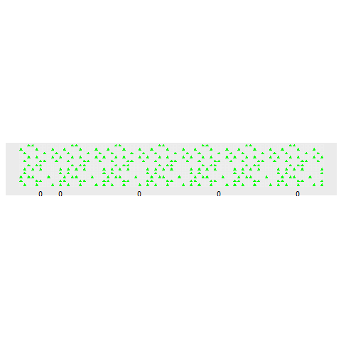

```{r setup, include=FALSE}
library(gganimate)
library(gifski)
library(ggplot2)
library(reshape2)
library(knitr)
library(dplyr)
library(stringr)
library(tidyverse)
library(readr)
library(collections)
options(scipen = 999)
```

```{r}
input<-read_lines("Day3Sample.txt")

### Matrix
forest<-matrix(0,nrow=length(input),ncol=nchar(input[1]))
for(i in 1:length(input)){forest[i,]<-unlist(str_split(input[i],""))}

```
## Part 1
run through the forest, hitting trees

```{r}
treehitter<-function(f){
  t<-c(1,1)
  trees<-0
  while(t[1]<=nrow(f)){
    if(f[t[1],t[2]]=="#"){trees<-trees+1}
    t<-t+c(1,3)
    while(t[2]>ncol(f)){t[2]<-t[2]-ncol(f)}}
trees}
```

```{r}
treehitter(forest)
```
## Part 2
Adjust treehitter so that the slope is variable

```{r}
treehitter2<-function(f,r,d){
  t<-c(1,1)
  trees<-0
  while(t[1]<=nrow(f)){
    if(f[t[1],t[2]]=="#"){trees<-trees+1}
    t<-t+c(d,r)
    while(t[2]>ncol(f)){t[2]<-t[2]-ncol(f)}}
trees}

```

```{r}
slps<-list(c(1,1),c(3,1),c(5,1),c(7,1),c(1,2))
part2<-sapply(slps,function(x){treehitter2(forest,x[1],x[2])})
part2<-prod(part2)
part2
```


```{r,echo=FALSE}
## set up background
fgdf<-melt(forest)
fg<-ggplot()+
  geom_point(data=fgdf,aes(x=Var2,y=Var1,color=value,shape=value,group=value))+
  geom_point(data=fgdf,aes(x=Var2+max(Var2),y=Var1,color=value,shape=value,group=value))+
  geom_point(data=fgdf,aes(x=Var2+2*max(Var2),y=Var1,color=value,shape=value,group=value))+
  geom_point(data=fgdf,aes(x=Var2+3*max(Var2),y=Var1,color=value,shape=value,group=value))+
  geom_point(data=fgdf,aes(x=Var2+4*max(Var2),y=Var1,color=value,shape=value,group=value))+
  geom_point(data=fgdf,aes(x=Var2+5*max(Var2),y=Var1,color=value,shape=value,group=value))+
  geom_point(data=fgdf,aes(x=Var2+6*max(Var2),y=Var1,color=value,shape=value,group=value))+
  scale_shape_manual(values=c(17,0))+
  scale_color_manual(values=c("green","#EEEEEE"))+
  theme(axis.text.x = element_blank(),
        axis.ticks.x = element_blank(),
        axis.text.y = element_blank(),
        axis.ticks.y = element_blank(),
        axis.title.y = element_blank(),
        axis.title.x = element_blank(),
        panel.grid.major = element_blank(),
        panel.grid.minor = element_blank(),
        legend.position="none")+
  scale_y_reverse()+
  coord_fixed()

### puts the tree hits into a dataframe
athit<-function(f,r,d){
  t<-c(1,1)
  realx<-1
  trees<-0
  df<-as.data.frame(matrix(ncol=3,nrow=0))
  while(t[1]<=nrow(f)){
    if(f[t[1],t[2]]=="#"){trees<-trees+1}
    df<-rbind(df,c(realx,t[1],trees))
    t<-t+c(d,r)
    realx<-realx+r
    while(t[2]>ncol(f)){t[2]<-t[2]-ncol(f)}}
df}
### dataframe for the numbers
trythisnow<-fg
newdir<-as.data.frame(matrix(nrow=0,ncol=5))
for(loper in 1:length(slps)){
  p1<-athit(forest,slps[[loper]][1],slps[[loper]][2])
  colnames(p1)<-c("x","y","trees")
  p1<-cbind(p1,t=1L:nrow(p1),s=loper)
  p1$t<-as.numeric(p1$t)
  p1$s<-as.numeric(p1$s)
  newdir<-rbind(newdir,p1)}

## animation for the lines
trythisnow<-fg
trythisnow<-trythisnow+
  geom_path(aes(x=x,y=y,group=s),data=newdir,colour=newdir$s)+
  transition_reveal(along = t)
###animatino for the numbers

for(i in 1:max(newdir$s)){
q<-newdir %>% filter(s==i)
trythisnow<-trythisnow+
  geom_text(data=q,aes(x=max(x),y=13,label=trees,group=s))}
```

```{r,warning=FALSE,echo=FALSE,eval=FALSE}
#build the gif
day3animation<-animate(trythisnow, nframes=11, renderer = gifski_renderer())
anim_save("day3.gif",day3animation)
```


